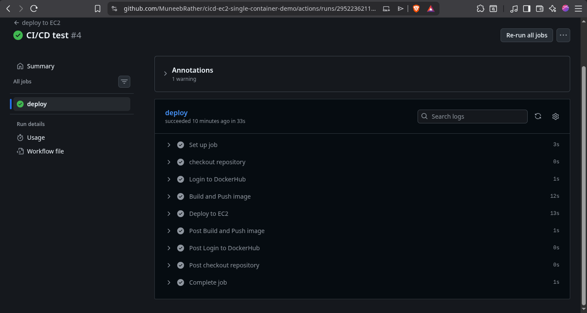
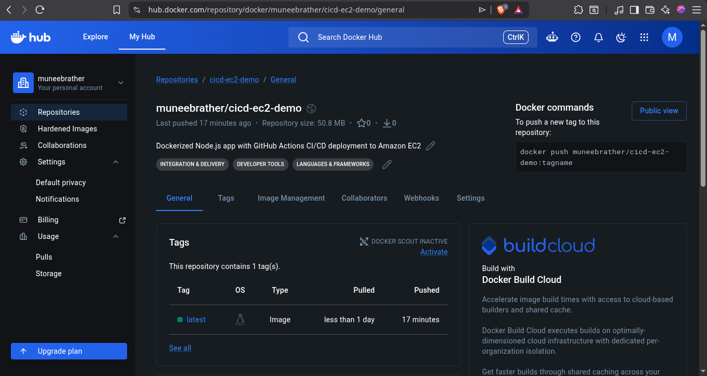
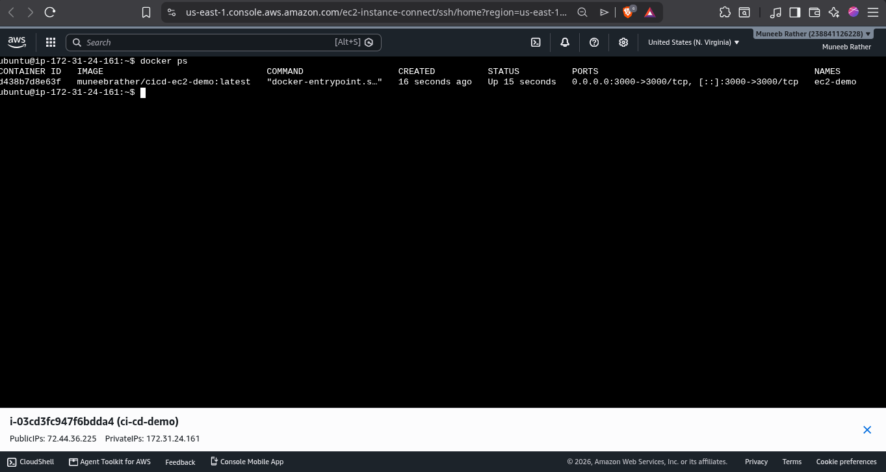
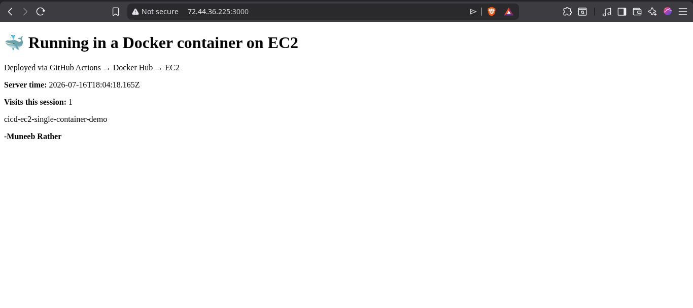

# cicd-ec2-single-container-demo

A minimal CI/CD project that automatically builds a Docker image from a Node.js application, pushes it to Docker Hub, and deploys it to an Amazon EC2 instance using GitHub Actions whenever changes are pushed to the `main` branch.

This repository is the second project in a four-part CI/CD learning series, with each repository introducing one new concept.

---

## Learning Series

| Repository | Focus |
|------------|-------|
| cicd-s3-demo | Deploy a static website to Amazon S3 using GitHub Actions |
| **cicd-ec2-single-container-demo** | Deploy a single Docker container to Amazon EC2 using GitHub Actions |
| cicd-ec2-multi-container-demo | Deploy a multi-container application to Amazon EC2 |
| cicd-branching-demo | Branch-based CI/CD with Pull Request validation and deployment |

---

## Features

- Containerized a Node.js/Express application using Docker
- Automated Docker image build with GitHub Actions
- Automatic image push to Docker Hub
- Automated deployment to an Amazon EC2 instance via SSH
- Automatic replacement of the running container with the latest image
- Continuous deployment on every push to the `main` branch

---

## Architecture

```text
Developer
    │
    ▼
Push to main
    │
    ▼
GitHub Actions
    │
    ├── Checkout repository
    ├── Login to Docker Hub
    ├── Build Docker image
    ├── Push image to Docker Hub
    ├── SSH into Amazon EC2
    ├── Pull latest image
    ├── Stop and remove old container
    └── Run new container
            │
            ▼
     Live Application on EC2
```

---

## Application

A minimal Node.js/Express application running inside a Docker container and deployed to Amazon EC2.

---

## Project Setup

1. Create a Dockerfile for the Node.js application.
2. Create a Docker Hub repository.
3. Generate a Docker Hub Access Token.
4. Launch an Amazon EC2 instance.
5. Install Docker on the EC2 instance.
6. Configure GitHub Secrets:
   - `DOCKERHUB_USERNAME`
   - `DOCKERHUB_TOKEN`
   - `EC2_HOST`
   - `EC2_USERNAME`
   - `EC2_SSH_KEY`
7. Push changes to the `main` branch.

GitHub Actions automatically builds the Docker image, pushes it to Docker Hub, and deploys the latest version to Amazon EC2.

---

## Workflow

The deployment workflow is located at:

```
.github/workflows/deploy.yml
```

---

## Project Status

- [x] Node.js/Express application created
- [x] Dockerfile written
- [x] Docker Hub repository created
- [x] Docker image successfully pushed
- [x] Amazon EC2 instance configured
- [x] Docker installed on EC2
- [x] GitHub Secrets configured
- [x] GitHub Actions workflow created
- [x] Automatic deployment verified

---

## Screenshots

### GitHub Actions

Successful workflow execution.



---

### Docker Hub

Docker image successfully pushed.



---

### Amazon EC2

Running Docker container.



---

### Live Application

Application running on the EC2 public IP.



---

## Key Learnings

- Building Docker images with GitHub Actions
- Publishing Docker images to Docker Hub
- Deploying containers to Amazon EC2 through SSH
- Replacing running containers during deployment
- Understanding Docker image lifecycle
- Structuring a complete CI/CD pipeline using GitHub Actions

---

## Tech Stack

- Node.js
- Express.js
- Docker
- Docker Hub
- Git
- GitHub
- GitHub Actions
- Amazon EC2
- SSH

---

## Author

**Muneeb Rather**